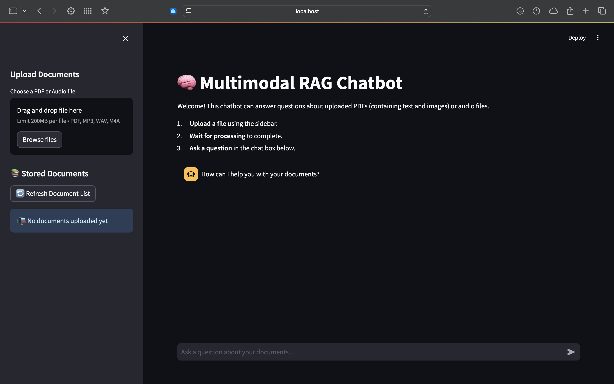

# 🧠 Multimodal RAG Chatbot

A sophisticated document-grounded chatbot that processes PDFs and audio files, extracting both text and images for intelligent question-answering using Retrieval-Augmented Generation (RAG) architecture.

## ⭐ Features

- **📄 PDF Processing**: Extract text and images from PDF documents
- **🎵 Audio Processing**: Transcribe audio files (MP3, WAV, M4A) using Whisper
- **🖼️ Image Understanding**: Local image captioning with BLIP model
- **💾 Persistent Storage**: ChromaDB vector database for document persistence
- **🤖 Intelligent Responses**: Context-aware answers using Mistral API
- **🔍 Document Management**: View, delete, and manage uploaded documents
- **⚡ Real-time Chat**: Interactive Streamlit interface
- **🔒 Privacy-First**: Local processing with no data retention by external APIs

## 🛠️ Tech Stack

- **Backend**: FastAPI, ChromaDB, PyMuPDF, Whisper, BLIP
- **Frontend**: Streamlit
- **AI/ML**: Transformers, Sentence Transformers, Mistral API
- **Storage**: Persistent vector database, local file system
